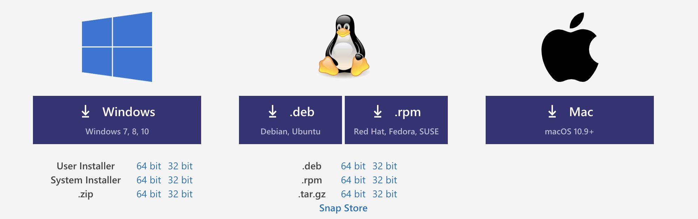
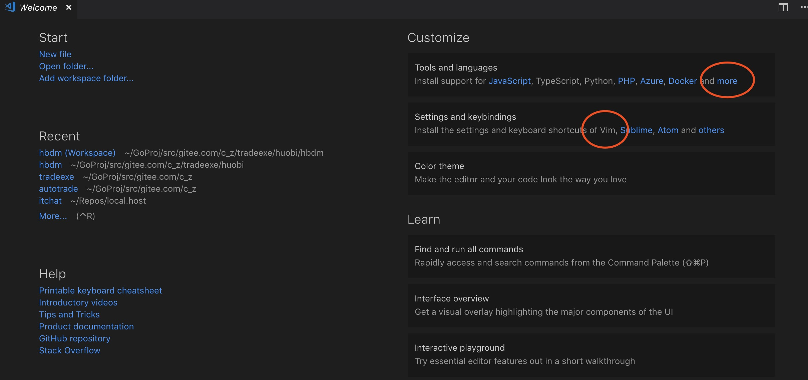
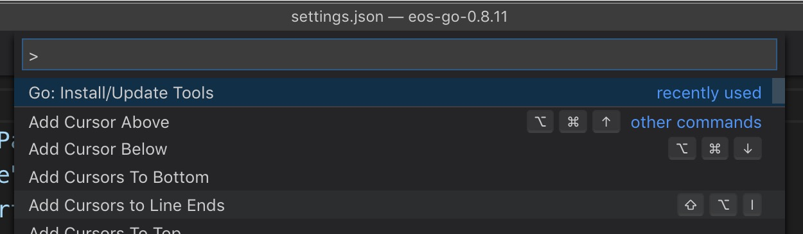
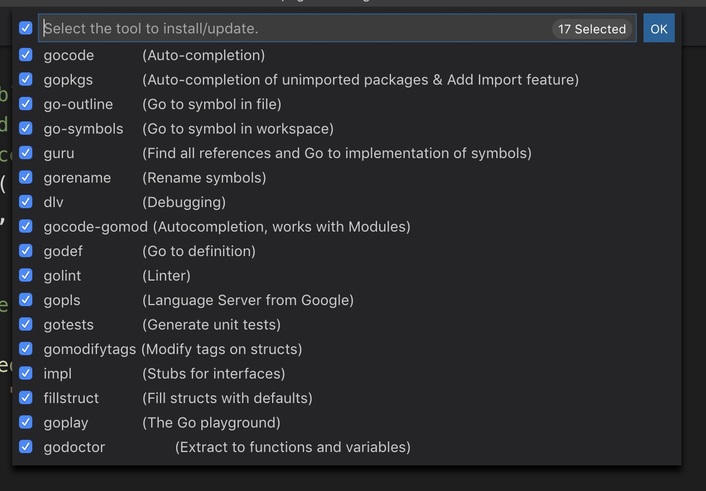
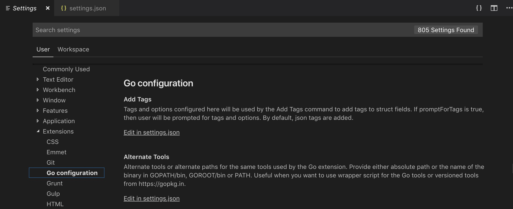

# Golang With VSCode

在去年的差不多时间（2018年4月底）我写了一篇[《Golang With Vim》](http://czkit.com/posts/vim/vim_golang/)。大概意思是说，在Vim8以后
Vim变的更好用，而且有了新时代的插件管理器Vundle，让Vim可以像Sublime一样很方便的去安装和管理插件。使得”编辑器之神“可以在我等凡人指下也可以666
的飞起。

如果本来就是后端相关工作的猿们，对Vim的接受程度肯定是更大。在过去的一年间，因为做了移动端开发的原因，深度使用了XCode和IDEA系列的产品，发现。如果
没有终端交互的限制，没有后端的开发经验的束缚。仅仅使用Mac作为开发环境（或者其他带桌面的Linux发行版本，如Ubuntu、Fedora)。那么一款操作简单，轻量，
UI丰富的编辑器（IDE)或许是Vim之外的另一选择。

此时现代化的轻量、扩张性强的编辑器大概有来自Github的Atom，老牌的Sublime以及微软的VS Code。因为开源文化的原因，本来是对微软的东西，就莫名的抵触的。
但是微软这几年在开源界的动作，又大有开放的姿态。另外今年Golang官方的调研也展示出VSCode以及成为最为流行的Golang IDE之一。所以就对VS Code进行了一次
尝试。最终的结论是，如果是没有特殊的IDE爱好，然后又是Golang的初体验，那么VSCode也需是个不错的选择。

## 安装 VS Code
安装非常简单。直接打开 [VSCode主页](https://code.visualstudio.com/) 首页直接下载。对于Mac这里下载的zip文件解压后，直接copy到Application目录下
就可以像普通装好的App一样用了。当然你也可以不去copy位置，直接双击。就好比Widnows下的绿色程序一样。

对于Windows是一个绿色的exe程序，也是下载下来双击就可以跑的程序，这一点和Sublime类似，所以说VSCode轻量，其实说轻便更合理一点。不像VS，按照起来吓死人
的流程。

当然对于上面说的带桌面的Linux发行版，VSCode也提供了相应的Deb包（Ubuntu）和Rpm包（Fedora）。

## 设置Vim模式
在打开VSCode的时候，会看到这里的Welcome的界面，在这里可以直接选择你习惯的快捷键模式，比如这里红圈中的Vim，以及支持的语言，比如这里可以选择Javascript或者
不接受争辩的"全世界最好的语言"的PHP，点击"More"(更多)，在扩展列表中（默认在左边，截图中是右边）。找到Go，然后点击"Install"，这样就装好了采用Vim快捷键的
支持Go语言扩展的VSCode了。

如果没有其他需求，基本上就可以开始浏览Go代码了，高亮什么的也都有。

感觉就是配置非常简单，效果也还过得去。

## 安装 Golang插件
再来增强下。

用快捷键"Shift+Command+P"打开命令行，并输入"Go:Install/Update Tools"

然后选择所有可以装的工具。

这个时候如果科学上网了的话，会提示安装成功。

然后再在设置里面配置下自动补齐就可以了。在Mac下面是点击“Code”=>"Perfomence"=>"Setting",在这里我们选择“Excetions"里面的"Go configuration"。

这里我们看到有一些可以设置的选项，我们也可以直接编辑配置文件，点击最开头的“Edit  in setting.json”。然后输入
	
		{
	    "editor.fontSize": 18,
	    "go.formatTool": "gofmt",
	    "go.autocompleteUnimportedPackages": true,
	    "go.gocodePackageLookupMode": "go",
	    "go.gotoSymbol.includeImports": true,
	    "go.useCodeSnippetsOnFunctionSuggest": true,
	    "go.inferGopath": true,
	    "go.useCodeSnippetsOnFunctionSuggestWithoutType": true,
	    "editor.minimap.enabled": false,
	    "workbench.sideBar.location": "right",
	    "go.useLanguageServer": true
	    
		}
		
配置字体大小和format工具以及自动提示。这里不过多介绍，默认的就够用很多，多了就不符合开篇的简单了，需要进行前面安装的工具的使用，可以逐一去Google配置。		

## 通过Github科学上网
如果上面没有科学上网，那么安装Go工具那块基本山是失败的，这里是唯一复杂的地方。

需要一些go moudle和go path的知识，没有的话就直接科学喽。

主要是这些tools都依赖golang.org/x/XXX下面的，而这个站被科学了，但是这些仓库在github.com/golang都是由镜像的，所以其实只要通过“go moudle”的“replace"
特性，将其用github进行代替就可以了。

这里我们以gocode 为例，首先找个位置将其clone下来：

	git clone github.com/mdempsky/gocode

然后得用Go 1.11以上版本，

	export GO111MODULE=on
	
打开Go Module

然后去到gocode路径下，执行：

	go build
	
此时会创建go.mod文件，但是	build会提示报错，因为下载不来golang/x/tools下面的module

这里我们手动修改go.mod文件，在最后增加：

	replace golang.org/x/tools => github.com/golang/tools latest

	replace golang.org/x/net => github.com/golang/net latest

	replace golang.org/x/sys => github.com/golang/sys latest

	replace golang.org/x/crypto => github.com/golang/crypto latest

然后在执行 go build:

	gocode cz$ go build
	go: finding github.com/golang/tools latest
	go: finding github.com/golang/net latest
	go: finding github.com/golang/sys latest
	go: finding github.com/golang/crypto latest
	go: downloading github.com/golang/tools v0.0.0-20190602112858-2de7f9bf822c
	go: extracting github.com/golang/tools v0.0.0-20190602112858-2de7f9bf822c

这样，就可以构建了，最后执行 go install，就会将其安装到$GOPATH/bin目录下了。

	gocode cz$ ls $GOPATH/bin
	gocode	
	
这时候，虽然"shift + command +p"打开"go: install/update tools"选择go code，还是提示失败（因为此时是更新，但是一样拉不到代码）但是gocode
已经可以被VSCode使用了，在打开其他.go文件时，不会再提示安装gocode。
	
其他的类似，都是可以在github找到镜像代码的，自行安装就可以了。

安装好后，我们看到$GOPATH/bin目录下有：

	bin cz$ ls $GOPATH/bin
	fillstruct	go-symbols	godef gomodifytags goplay gorename impl golint
	go-outline	gocode		godoctor   gopkgs   gopls   guru    dlv   gotests

总共16个工具，（gocode有两个，推荐github.com/stamblerre/gocode，支持go.mod）替换上面作为示例也是最原始的github.com/mdempsky/gocode。	

上面有个语法没说，就是replace，标准的语法是 
	
	source version => replace version
	
这里我们source不行版本，然后replace的版本写"latest"这样主要是可以自动推断最新一次的提交，而且golang/x/XXX的github基本上都没带版本。所以这么写就可以了。

## 总结
前面就说了，对于没有IDE偏好的，然后又是初次体验GOlang（大部分是看开源项目代码）。那么这么一款经过简单几步配置就可以高亮、跳转、自动补齐甚至可以调试的
轻量级、高扩展的编辑器，可能就是个蛮好的选择。整个弄下来，若不是插件那块墙的原因，真的是3步就开始go go go...
